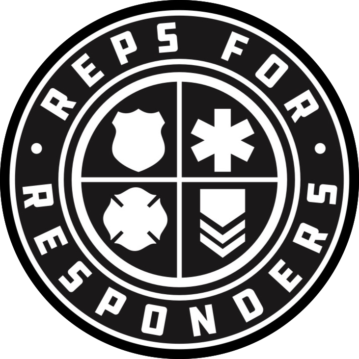

<div align="center">
    
  <h1>Reps for Responders</h1>
  <p>Built with gatsbyjs</p>
</div>

***********************************************

## Usage
### Running the app in Development
  Start the development server
  ```
  yarn dev
  ```
  Open the app in your browser
  ```
  http://localhost:8000/
  ```

***********************************************

### Build the app for Production
  Build the app
  ```
  yarn build
  ```

***********************************************

### Clear the cache and public directories
  Useful to clear stale data
  ```
  yarn clean
  ```

***********************************************

## Helpful Resources
- [gatsby docs](https://www.gatsbyjs.org/docs/)
- [building a blog with gatsby and strapi](https://strapi.io/blog/build-a-static-blog-with-gatsby-and-strapi)
- [gatsby-source-strapi](https://github.com/strapi/gatsby-source-strapi)
